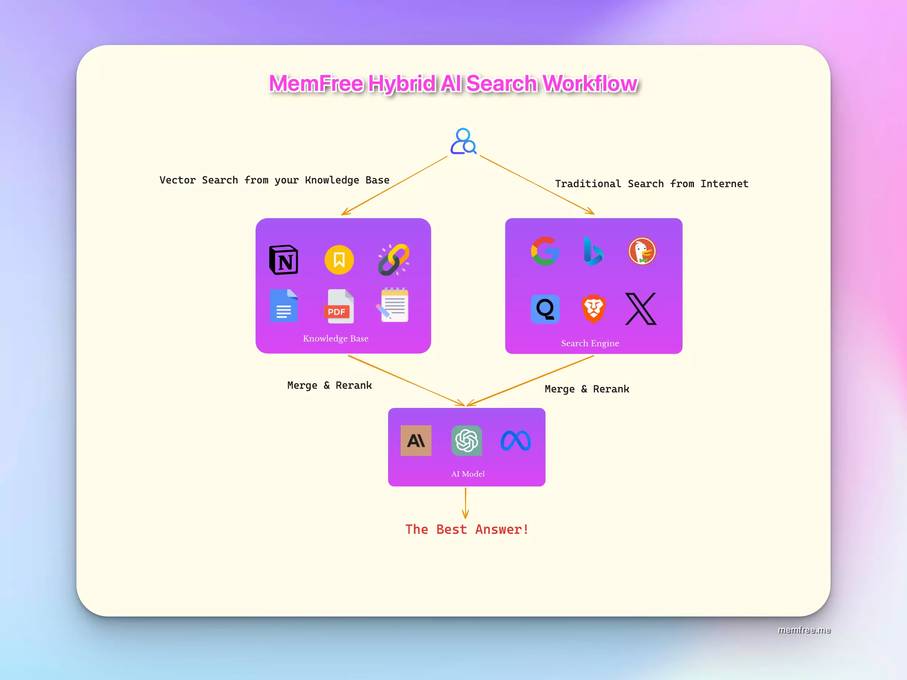

# MemFree

<h1 align="center"><a href="https://www.memfree.me">MemFree</a></h1>

**Englisch**\|[chinesisch](./README.zh-CN.md)\|[Deutsch](./README.de.md)\|[Französisch](./README.fr.md)\|[Spanisch](README.es.md)\|[japanisch](./README.ja.md)

<h4 align="center">
  
  
  
    
  

</h4>

 

## Was ist MemFree

MemFree ist ein<b>Hybride KI-Suchmaschine</b>.

Mit MemFree können Sie sofort präzise Antworten aus Ihrer Wissensdatenbank und dem gesamten Internet erhalten.

MemFree ist ein<b>AI-Seitengenerator</b>.

Memfree nutzt das leistungsstärkste KI-Modell – Claude 3.5 Sonnet und das beliebteste Front-End-Framework – React + Tailwind + Shadcn UI, um in Sekundenschnelle produktionsbereite UI-Seiten für Sie zu generieren.

[PageGen – KI-Seitengenerator](https://pagegen.ai/).

## Was macht MemFree wertvoll?

-   **Effizientes Wissensmanagement**: MemFree macht die manuelle Organisation von Notizen, Lesezeichen und Dokumenten überflüssig. Wenn Sie Informationen benötigen, suchen Sie einfach in MemFree, um schnell relevante Antworten zu finden, was Ihren Speicher frei macht und die Produktivität steigert.
-   **Zeitsparende KI-Zusammenfassungen**: Anstatt sich durch mehrere Google-Suchergebnisse zu klicken, nutzt MemFree KI, um sofort die besten Inhalte von Webseiten und Ihrer Wissensdatenbank zusammenzufassen und so wertvolle Zeit zu sparen.
-   **Kostengünstige Lösung**: Vermeiden Sie mehrere Abonnements für Dienste wie ChatGPT Plus, Claude Pro und Gemini Advanced. MemFree integriert deren Funktionalitäten und reduziert so die monatlichen Kosten erheblich.
-   **100x schnellere UI-Seitenerstellung**: Konvertieren Sie Text oder Bilder in Sekundenschnelle in beeindruckenden, produktionsbereiten Code. Visualisieren Sie Ihre Designs während der Erstellung. Veröffentlichen Sie Ihre Seiten nahtlos.

## MemFree Hybrid AI-Suchfunktionen

MemFree ist mit leistungsstarken Funktionen ausgestattet, die verschiedene Such- und Produktivitätsanforderungen erfüllen:

-   🤖**Mehrere KI-Modelle**: Integriert ChatGPT, Claude und Gemini für verschiedene KI-Funktionen.

-   🌐**Mehrere Suchmaschinen werden unterstützt**: Funktioniert mit Google, Exa und Vector.

-   🖼️**Mehrere Sucheingabeformate**: Insbesondere Texte, Bilder, Dateien und Webseiten. Unterstützt die Suche, den Vergleich, die Zusammenfassung und die Analyse mehrerer Bilder.

-   📊**Mehrere Methoden zur Ergebnispräsentation**: Text, Mindmaps, Bilder und Videos.

-   📄**Kompatibilität mit lokalen Dateiformaten**: Unterstützt Text-, PDF-, Docx-, PPTX- und Markdown-Dateien.

-   🔄**Geräteübergreifende Synchronisierung**: Suchverlauf auf mehreren Geräten speichern und synchronisieren.

-   🌍**Mehrsprachige Unterstützung**: Verfügbar in Englisch, Chinesisch, Deutsch, Französisch, Spanisch, Japanisch und Arabisch.

-   🔗**Chrome-Lesezeichen-Synchronisierung**: Synchronisierung und Indizierung mit einem Klick.

-   📤**Ergebnisfreigabe**: Teilen Sie ganz einfach Ihre Suchergebnisse.

-   🔍**Kontextuelle kontinuierliche Suche**: Nahtlose Suche basierend auf dem Kontext.

-   ⚙️**Automatische Websuchentscheidungen**: Bestimmt automatisch, wann Internetsuchen durchgeführt werden sollen.

## Funktionen des MemFree AI UI Generators

-   **🖥️ Echtzeit-UI-Vorschau**: Generierte Benutzeroberfläche sofort rendern und in der Vorschau anzeigen
-   **🔍 KI-gestützte Inhaltssuche**: Bereichern Sie Ihre Benutzeroberfläche mit relevanten Inhalten mithilfe unserer erweiterten KI-Suchfunktion
-   **🖼 Bildgesteuerte UI-Generierung**: Erstellen Sie UI-Komponenten und Seiten, die Ihren Referenzbildern genau entsprechen
-   **📄 Datei-zu-Seite-Generierung**: Verwandeln Sie jeden Dateiinhalt in eine schön strukturierte Webseite mit KI-Analyse und KI-Zusammenfassung
-   **✏️ Code-Editor-Integration**: Bearbeiten und verfeinern Sie Ihren generierten Code mit VSCode-ähnlichen Bearbeitungsfunktionen, einschließlich Syntaxhervorhebung und automatischer Vervollständigung
-   **✨ Animationsunterstützung**: Erstellen Sie ansprechende Webseiten mit integrierten Animationseffekten und erwecken Sie Ihre Inhalte mit sanften Übergängen und dynamischen Elementen zum Leben
-   **⚛️ React + TailWind + Shadcn UI-Integration**: Nutzen Sie KI-generierten Code mit dem beliebtesten Front-End-Stack: React, TailWind und Shadcn UI
-   **🚀 One-Click-UI-Veröffentlichung**: Veröffentlichen und teilen Sie Ihre Benutzeroberfläche sofort mit einem einzigen Klick im Web
-   **📱 Responsiver Code und Vorschau**: Sehen Sie sich Ihre Benutzeroberfläche in Echtzeit auf verschiedenen Geräten an und sorgen Sie so für eine perfekte Anpassung an alle Bildschirmgrößen
-   **🌓 Dark-Mode-Code und Vorschau**: Generieren Sie mühelos KI-gestützten UI-Code mit integrierter Unterstützung für den Dunkelmodus, sodass Sie sofort eine Vorschau sowohl des Hell- als auch des Dunkelmodus anzeigen können
-   **📸 UI-Screenshot-Export**: Exportieren und teilen Sie Ihre UI-Designs ganz einfach als hochwertige Screenshots für eine nahtlose Zusammenarbeit
-   **🛠️ Intelligente Fehlerkorrektur**: Während das fortschrittliche KI-Modell und die ausgefeilten Coderegeln von MemFree nach Perfektion streben, können gelegentlich Fehler auftreten. Mit unserer intelligenten Fehlerkorrekturfunktion können Sie alle Probleme sofort mit nur einem Klick beheben

## MemFree Hybrid AI Search Workflow

## ChangeLog

[MemFree ChangeLog](https://www.memfree.me/changelog)

## Tech-Stack

[Hybride KI-Suche, vollständiger Tech-Stack](https://www.memfree.me/blog/hybrid-ai-search-tech-stack)

## One-Click-Bereitstellung

[Anleitung zur MemFree One-Click-Bereitstellung](https://www.memfree.me/docs/one-click-deploy-ai-search)

### 1 Backend mit Zeabur bereitstellen

### 2 Stellen Sie das Frontend mit Vercel bereit

<a href="https://vercel.com/new/clone?repository-url=https%3A%2F%2Fgithub.com%2Fmemfreeme%2Fmemfree&env=UPSTASH_REDIS_REST_URL,UPSTASH_REDIS_REST_TOKEN,OPENAI_API_KEY,MEMFREE_HOST,AUTH_SECRET,API_TOKEN&envDescription=https%3A%2F%2Fgithub.com%2Fmemfreeme%2Fmemfree%2Fblob%2Fmain%2Ffrontend%2Fenv-example&project-name=memfree&repository-name=memfree&demo-title=MemFree&demo-description=MemFree – Hybrid AI Search Engine&demo-url=https%3A%2F%2Fwww.memfree.me%2F&demo-image=https%3A%2F%2Fwww.memfree.me%2Fog.png&root-directory=frontend"></a>

### 3 Stellen Sie das Frontend mit Netlify bereit

### 4 Einsatz auf der Schiene

### 5 One Command Deploy Backend mit Fly.io

-   [Ein Befehl: Bereitstellen von MemFree Vector auf Fly.io](https://www.memfree.me/docs/deploy-memfree-fly-io)

### 6 Stellen Sie MemFree auf Cloudflare-Seiten bereit

-   [Weitere Informationen zur Migration von MemFree von Vercel zu Cloudflare finden Sie auf den nächsten Seiten](https://www.memfree.me/blog/couldflare-next-on-page-edge)

## Selbstgehostete Installationen

### Voraussetzungen

#### Gut installieren

    curl -fsSL https://bun.sh/install | bash

> Fehler „Brötchen nicht gefunden“.

Wenn Sie eine Fehlermeldung erhalten, die sich darauf bezieht, dass der Bun-Befehl nicht gefunden wurde. Schauen Sie sich Folgendes an:[Offizielle Bun-Dokumentation](https://bun.sh/docs/installation#checking-installation)

#### Upstash Redis

Erstellen Sie in Sekundenschnelle eine Redis-kompatible Datenbank:[Upstash Redis](https://upstash.com/docs/redis/overall/getstarted)

#### OpenAI-API-Schlüssel

Holen Sie sich einen OpenAI-API-Schlüssel:[OpenAI](https://platform.openai.com)

#### Serper-API-Schlüssel

Holen Sie sich einen Serper-API-Schlüssel:[Serper](https://serper.dev/api-key)

### Frontend

    cd frontend

    bun i

    cp env-example .env

    # Add your OpenAI API Key, Upstash Redis URL, and Serper API Key to .env

    bun run dev

### Vektordienst

    cd vector

    bun i

    cp env-example .env

    # Add your OpenAI API Key, Upstash Redis URL to .env

    bun run index.ts

## Mitwirken

So können Sie einen Beitrag leisten:

-   [Öffnen Sie ein Problem](https://github.com/memfreeme/memfree/issues)wenn Sie glauben, dass Sie auf einen Fehler gestoßen sind.
-   Machen Sie ein[Pull-Anfrage](https://github.com/memfreeme/memfree/pulls)um neue Funktionen hinzuzufügen/die Lebensqualität zu verbessern/Fehler zu beheben.

## Vielen Dank an alle Mitwirkenden

 

## Hilfe und Support

-   [MemFree Discord](https://discord.com/invite/7QqyMSTaRq)

## Roadmap

-   [MemFree-Roadmap](https://www.memfree.me/roadmap)

## Lizenz

MemFree wird unterstützt von[MemFree](https://www.memfree.me/)und lizenziert unter[MIT](https://github.com/memfreeme/memfree/blob/main/LICENSE).

## Unterstützt von MemFree

-   [PageGen – KI-Seitengenerator](https://pagegen.ai)
-   [MemFree – Hybride KI-Suche](https://www.memfree.me)
-   [StorySnap – Verwandeln Sie Bilder in Geschichten](https://www.snapstoryai.com)
-   [React + Shadcn UI-Vorschau](https://reactshadcn.com)

## Sternengeschichte

